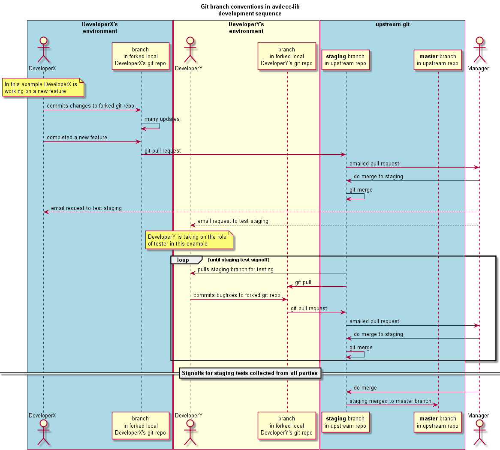

avdecc-lib
==========

Simple C++ library for implementing IEEE1722.1 (AVB Device Enumeration, Discovery and Control).

Introduction
------------

This library aims to simplify development of an AVDECC Controller based on the IEEE1722.1 specification.
It provides a simple C++ object interface to 1722.1 objects and implements device discovery and enumeration
as a background process.

The repository contains source to build a Windows DLL or a Linux library and a command line application for
exercising the library.

The overall philosophy of AVDECC LIB is to implement a thin layer of commands that allow an application to
discover and control AVDECC capable End Stations. The internal operations of the library are designed to be single threaded,
although multiple threads are used to queue operations to be performed by the single threaded "engine" portion of the library.
The library supports notification events (callbacks) that are triggered on the success (or failure) of a command. 
It is up to the application to process the notifications in a useful manner. Asynchronous descriptor updates from an
End Station are also supported. A descriptor notification does not have data about the updated descriptor values embedded
in it. Instead the AVDECC application should query the descriptor class to obtain the updated values.

Operations that "fetch" details or status of an End Station store the response for later readback by the controller application.
An example of this would be the AEM send_get_stream_info_cmd() operation whose response is stored in the appropriate stream input object in avdecc-lib.
Functions get_stream_info_msrp_accumulated_latency(), get_stream_info_msrp_failure_code() and others can then be used to readback fields of the response.

Users developing 1722.1 end stations and controllers are encouraged to add new descriptors to this library as required.
The library provides an easy entry point for adding and testing a completely new 1722.1 descriptor without having
to develop a complete controller side 1722.1 software stack.

Dependencies
------------

Uses Jeff Koftinoff's packet processing library, see <https://github.com/jdkoftinoff/jdksavdecc-c.git>
This is a submodule that can be cloned using:

	cd avdecc-lib
	git submodule init
	git submodule update

As of March 2014, avdecc-lib is following the master branch of jdksavdecc-c (from github).

Acknowledgements
----------------

Special thanks are owed to Jeff Koftinoff for creating and releasing public source for 1722.1 packet processing in
the jdksavdecc-c library and for comments and advice freely given during the development of this library. This C++
library is a rather thin wrapper around functions already present in the jdksavdecc-c library.

Community
---------

Please join Google Group "avdecc-lib" if you wish to comment on avdecc-lib, or keep track of discussions.

Directory layout
----------------

	controller\	
		lib\
			bin\
			doc\
			binding\
				python\
			include\ (contains public header files)
			src\ (contains private header files and C++ source code)
				linux\ (linux specific files)
				msvc\ (Microsoft Visual Studio specific files)
				
		app\
			bin\
			doc\
			cmdline\
				src\
			test\
				strings\
				adp\
				logging\ 
				notify\		
				
Object hierarchy
----------------
 
	System
	Controller
		End Station[1..N]
			Entity[1..N]
				Configuration[1..N]
					Audio Unit[1..N]
							Stream Port Input[0..N]
										Audio Cluster[0..N]
										Audio Map[0..N]
										Control[0..N]
							Stream Port Output[0..N]
										Audio Cluster[0..N]
										Audio Map[0..N]
										Control[0..N]
							External Port Input[0..N]
							External Port Output[0..N]
							Internal Port Input[0..N]
							Internal Port Output[0..N]
							Control[0..N]
							Signal Selector[0..N]
							Mixer[0..N]
							Matrices[0..N]
							Splitter[0..N]
							Combiner[0..N]
							Demultiplexer[0..N]
							Transcoder[0..N]
							Control Block[0..N]
					Stream Input[1..N]
					Stream Output[1..N]
					Jack Input[1..N]
					Jack Output[1..N]
					AVB Interface[1..N]
					Clock Source[1..N]
					Clock Domain[1..N]
	
Building
--------

All build environments require

1. cmake v2.8

Run cmake to create the build dirctories for your environment.

	cd avdecc-lib
	cmake .

### Windows ###
	
Prerequisites

1. MSVC 2013 or later
2. winpcap development package from <http://www.winpcap.org/devel.htm>

The following environment variables must be defined:
* WPCAP_DIR the directory where WinPcap is installed

### Linux ###

Prerequisites

1. gcc development environment (v4.8 or later)
2. libedit
3. readline library, may need to go "sudo apt-get install libreadline5-dev"

### OSX ###

ToDo

Operations
==========

AVDECC Controller version
-------------------------

The AVDECC Controller version number can be updated inside the version header file.

AVDECC End Station Discovery
----------------------------

When the AVDECC system receives an AVDECC advertise message from an End Station, it proceeds to
enumerate the End Station's complete object model, if it has not done so already. Upon completion
of the enumeration process, a notification message is sent to the application.

AVDECC AEM descriptor reads
---------------------------

A descriptor read by referencing the object the object of interest. Since the AVDECC system has
already read all descriptors, the read operation is completed without producing any network traffic.

To read the name of the first input jack, one would go:

	controller->end_station(0)->entity(0)->configuration(0)->input_stream(0)->get_name(name)

AVDECC AEM commands
-------------------

An AVDECC command is sent to the target object, ie:

	istream = controller->end_station(0)->entity(0)->configuration(0)->input_stream(0);
	id = (void *)notify_id;
	// put the notify_id value in a list somewhere
	istream->set_format(id, format,...);
	notify_id++;

Completion results in a notification message of success or failure via the callback mechanism. An alternative calling
sequence is to wait for the callback to complete in-line, ie:

	id = (void *)notify_id;
	avdecc_system->set_wait_for_next_cmd(id);
	istream = controller->end_station(0)->entity(0)->configuration(0)->input_stream(0);
	istream->set_format(id, format,...);
	status = avdecc_system->get_last_resp_status();
	notify_id++;

The above examples place an uint32_t notify_id in a "void *" container. If the application writer is careful about
object creation and destruction, they may choose to place a C++ (or other language) object in the notify_id field.

Callbacks
---------

The following callback functions should be supplied. If NULL is passed in for the callback function, no callback will be invoked.

	void log_callback(void *log_user_obj, int32_t log_level, const char *log_msg, int32_t time_stamp_ms);
	void notification_callback(void *notification_user_obj, int32_t notification_type, uint64_t guid, uint16_t cmd_type, uint16_t desc_type, uint16_t desc_index, void *notification_id);

When a controller internal thread calls the log_callback function that was invoked at controller create time,
the log_user_obj pointer that was passed in at that time is returned in the callback. The calling application
code use this void pointer to store a C++ class if that was helpful to the structure of the calling application.
The log_callback is called with log_level values of:
* ERROR
* WARNING
* NOTICE
* INFO
* DEBUG
* VERBOSE
	
Like the log_callback function the notification callback returns a void "user" pointers as the first field in the callback.
The notification_callback is called with notification_type values of:
* NO MATCH FOUND
* END STATION CONNECTED
* END STATION DISCONNECTED,
* COMMAND TIMEOUT
* RESPONSE RECEIVED
* END_STATION_READ_COMPLETED

Source code style
-----------------

Source code is auto-formatted using the astyle formatting tool. All submitted pull requests should be passed through astyle
before the pull request is issued. The format to use is specified in the astyle_code_format option file in this
directory. asytle is run from the command line using the following command sequence:

	AStyle --options=..\avdecc-lib\astyle_code_style.txt ..\avdecc-lib\controller\lib\include\*.h
			 ..\avdecc-lib\controller\lib\src\*.h ..\avdecc-lib\controller\lib\src\*.cpp
			 ..\avdecc-lib\controller\lib\src\msvc\*.h ..\avdecc-lib\controller\lib\src\msvc\*.cpp
			 
Source documentation
--------------------

A standard tool, Doxygen, is used for generating documentation from the AVDECC Controller Lib source code.
A link to the online version of the AVDECC Controller Lib documentation can be found at:
http://www.audioscience.com/internet/download/sdk/avdecclib_usermanual_html/html/index.html

Development Conventions
=======================

Developers should add new features to the *staging* git branch. Periodically the *staging* git branch
will be merged to the *master* branch.

Roadmap
=======

Working towards release version 1.0.0.

Release 1.0.0 supports:
* all of the P1 Command/responses listed below.
* Windows, linux and OSX builds.

Future features include:
* security key passing
* Layer 3 (IP)  interface
* other descriptors as required

Status
======

Command/Response | Priority | Implemented | Tested |
-----------------|----------|-------------|--------|
ACQUIRE_ENTITY | P1 | Y | Y |
LOCK_ENTITY | P1 | Y | Y |
ENTITY_AVAILABLE | P1 | Y | Y |
CONTROLLER_AVAILABLE | P1 | Y | Y |
READ_DESCRIPTOR | P1 | Y | Y |
SET_STREAM_FORMAT | P1 | Y | Y |
GET_STREAM_FORMAT | P1 | Y | Y |
SET_STREAM_INFO | P1 | | |
GET_STREAM_INFO | P1 | Y | Y |
SET_SAMPLING_RATE | P1 | Y | Y |
GET_SAMPLING_RATE | P1 | Y | Y |
SET_CLOCK_SOURCE | P1 | Y | Y |
GET_CLOCK_SOURCE | P1 | Y | Y| 
START_STREAMING | P1 | Y | Y |
STOP_STREAMING | P1 | Y | Y |
SET_CONFIGURATION | P2 | | |
GET_CONFIGURATION | P2 | | |
SET_CONTROL | P2 | | |
GET_CONTROL | P2 | | |
SET_NAME | P2 | | |
GET_NAME | P2 | | |
SET_MIXER | P2 | | |
GET_MIXER | P2 | | |
REGISTER_UNSOLICITED_NOTIFICATION | P2 | | |
DEREGISTER_UNSOLICITED_NOTIFICATION | P2 | | |
IDENTIFY_NOTIFICATION | P2 | | |
GET_AVB_INFO | P2 | | |
GET_AS_PATH | P2 | | |
REBOOT | P2 | | |
WRITE_DESCRIPTOR | P3 | | |
SET_ASSOCIATION_ID | P3 | | |
GET_ASSOCIATION_ID | P3 | | |
INCREMENT_CONTROL | P3 | | |
DECREMENT_CONTROL | P3 | | |
SET_SIGNAL_SELECTOR | P3 | | |
GET_SIGNAL_SELECTOR | P3 | | |
SET_MATRIX | P3 | | |
GET_MATRIX | P3 | | |
GET_COUNTERS | P3 | | |
GET_AUDIO_MAP | P3 | | |
ADD_AUDIO_MAPPINGS | P3 | | |
REMOVE_AUDIO_MAPPINGS | P3 | | |
START_OPERATION | P3 | | |
ABORT_OPERATION | P3 | | |
OPERATION_STATUS | P3 | | |
SET_VIDEO_FORMAT | P4 | | |
GET_VIDEO_FORMAT | P4 | | |
SET_SENSOR_FORMAT | P4 | | |
GET_SENSOR_FORMAT | P4 | | |
GET_VIDEO_MAP | P4 | | |
ADD_VIDEO_MAPPINGS | P4 | | |
REMOVE_VIDEO_MAPPINGS | P4 | | |
GET_SENSOR_MAP | P4 | | |
ADD_SENSOR_MAPPINGS | P4 | | |
REMOVE_SENSOR_MAPPINGS | P4 | | |

#### ToDo ####

Release Notes
=============

None so far.
